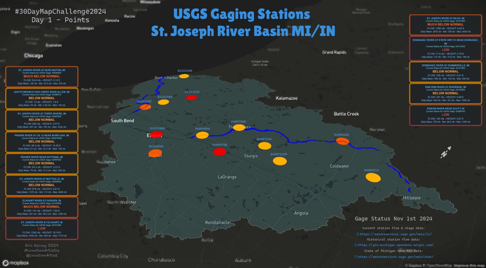

# Day1Points
### #[30DayMapChallenge2024](https://30daymapchallenge.com/) - #Day1Points

  

USGS Stream Gage Station Data in the St. Joseph River Watershed MI/IN.   
To obtain station status there are two separate endpoints, one with the current status, and another for historical flow data. Stations are colored by current flow percentile and additional side panel info with matching ID.   

Basin and river data from the State of Michigan GIS Open Data. All live cloud data sources.   

DeckGL map using GeoJSON Layer for spatial data viz.    

[30DayMapCollection2024 interactive map notebooks](https://observablehq.com/@location-artistry/30daymapchallenge2024)
