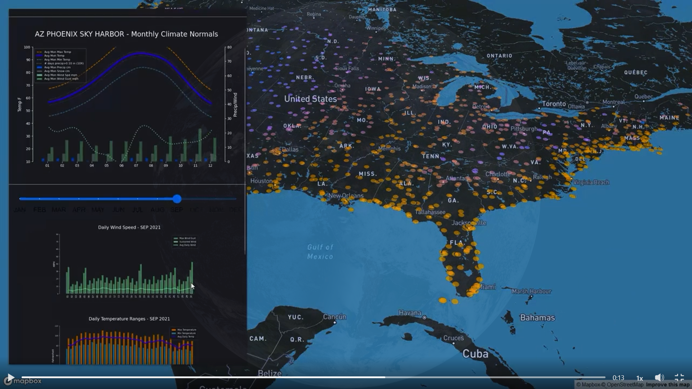

# Day2Lines
### #[30DayMapChallenge2024](https://30daymapchallenge.com/) - #Day2Lines

  

NOAA airport weather stations 
Lines shown on dynamic hashtag#climographs

DATA
> NOAA Climate Data API v2 - https://lnkd.in/eKANegjt

STACK   
> DeckGL - React - Mapbox

API   
> Python - Flask - matplotlib - render.com     
> Flask API -=> NOAA Climate API with station ID    
> Custom climographs generated in matplot lib as images    
> Lines: avg monthly, min & max temp(F), # days with precip(x10)    
> Bars: avg monthly wind spd, gust, precip & snow (mph/cm)   

Revived an older POC for this one! It's a bit rough, and generating the climographs is certainly not snappy, though I think they look nicer than many examples. 
Needed to shift the API deploy from Heroku to Render, make a few updates to the map/app and move from AWS to github pages    

[Day2 Map Live Link](https://ekerney.github.io/reactMapTest/)
