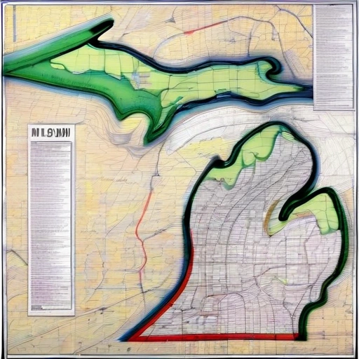
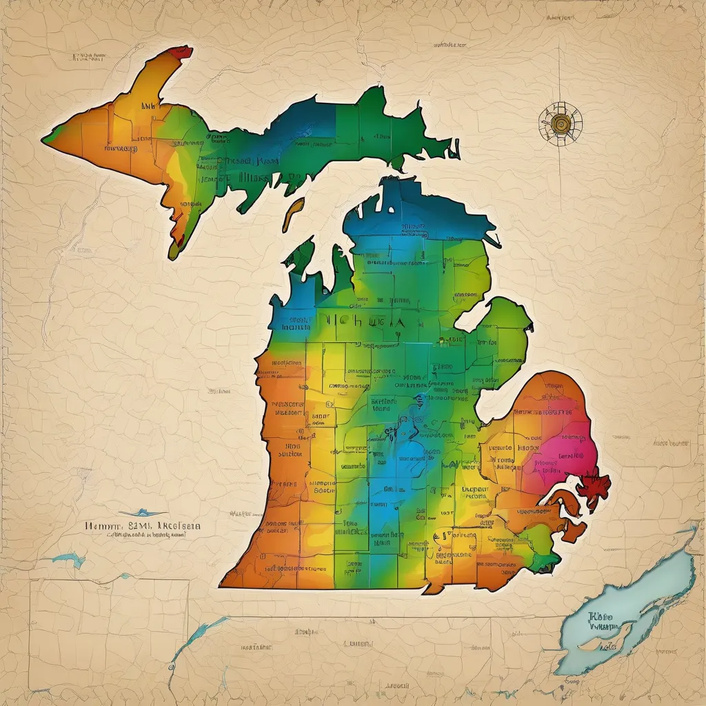

# Day9AIonly
### [#30DayMapChallenge2024](https://30daymapchallenge.com/) - #Day3AIonly

  
  &nbsp&nbsp&nbsp&nbsp&nbsp&nbsp&nbsp&nbsp
  
  &nbsp&nbsp&nbsp&nbsp&nbsp&nbsp&nbsp&nbsp
  
  &nbsp&nbsp&nbsp&nbsp&nbsp&nbsp&nbsp&nbsp
  
  &nbsp&nbsp&nbsp&nbsp&nbsp&nbsp&nbsp&nbsp
  
  &nbsp&nbsp&nbsp&nbsp&nbsp&nbsp&nbsp&nbsp
  
  &nbsp&nbsp&nbsp&nbsp&nbsp&nbsp&nbsp&nbsp
  
  &nbsp&nbsp&nbsp&nbsp&nbsp&nbsp&nbsp&nbsp
  
  &nbsp&nbsp&nbsp&nbsp&nbsp&nbsp&nbsp&nbsp

When Midjourney started charging a subscription fee, it was time to explore #localAI image generation. Experiments with local install of #InvokeAI, #StableUI web interface, and StableUI in colab cloud notebook.

StableUI in Colab with Stable Diffusion XL model generated best results and was very snappy. Local InvokeAI on WSL2 without GPU support took several minutes, even using only 10 steps per run.

- 1 Best result running StableUI AI in Google Colab - Stable Diffusion XL
- 2 City of Detroit as an island - Dreamshaper8 - Local InvokeAI - Ubuntu 22.04
- 3 Random initial results - Dreamshaper8 - Local InvokeAI - Ubuntu 22.04 
- 4 Decent outline of the State of Michigan! - StableUI AI web interface 
- 5 Fun swirly highway-ish map of Michigan - StableUI AI web interface 
- 6 Northwest territories map... - StableUI AI Google Colab - Stable DiffusionXL 
- 7 Rainbow Topo... accuracy? - StableUI AI Google Colab - Stable DiffusionXL 
- 8 Running InvokeAI locally - Spins up server with nice webUI

[LinkedIn Post from Day9](https://www.linkedin.com/posts/eric-kerney_30daymapchallenge2024-day9aionly-localai-activity-7261789157276938241-ZASk?utm_source=share&utm_medium=member_desktop)
