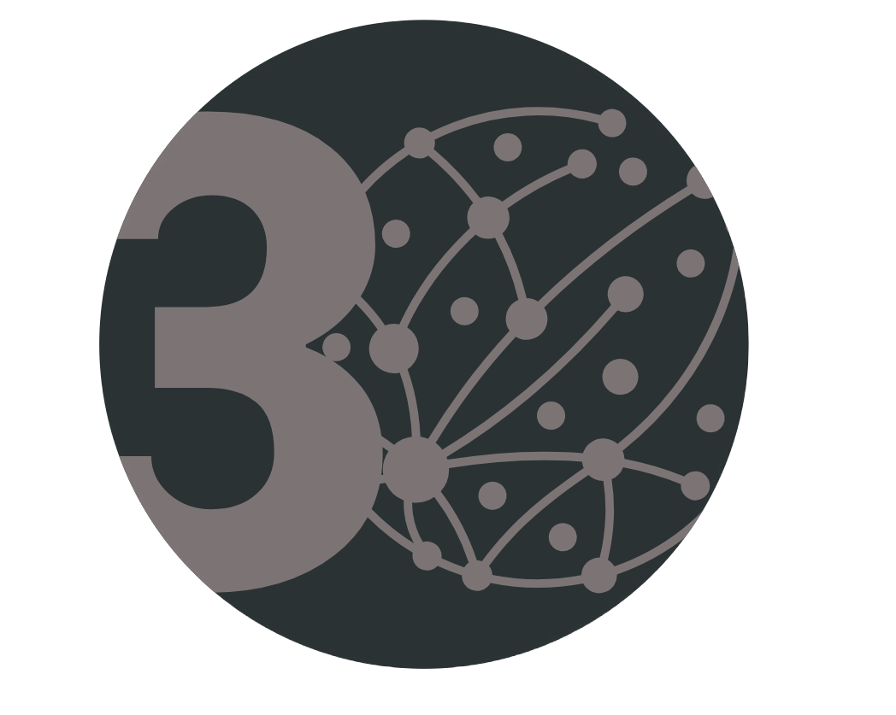

# 30DayMapChallenge2024
### Notes & Resources & Maps for 30DayMapChallenge2024
Daily social mapping project happening every November   
Create maps based around differing themes each day in November and share with #30DayMapChallenge   

  
  &nbsp&nbsp&nbsp&nbsp&nbsp&nbsp&nbsp&nbsp

This year I have decided to focus on a few key technologies/tools:
- [DeckGL](https://deck.gl/)
- [H3geo](https://h3geo.org/)
- [GeoParquet](https://geoparquet.org/)
- [Overture Maps Data](https://overturemaps.org/)
- [Lonboard](https://github.com/developmentseed/lonboard)
